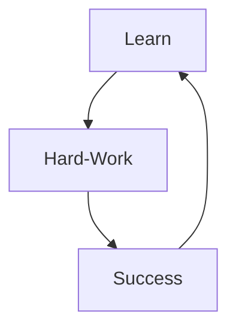

<h1 align="center">Hi👋 I'm Jeremy Bruzac !</h1>

<h3 align="center">Vuejs Frontend developer :)</h3> 

- 🔭 I’m currently working on Student Project (Last) on [OpenClassrooms](https://openclassrooms.com/fr/)
- 🌱 I’m currently learning PHP, NuxtJs
- 📫 How to reach me: bruzacj@yahoo.fr
- ⚡ Fun fact: I’m an amateur blacksmith ⚒️🔥

<h3 align="left">Connect with me:</h3>

<h3 align="left">Languages and Tools:</h3>

  
 

 

<h3 align="left">My Credo:</h3>

